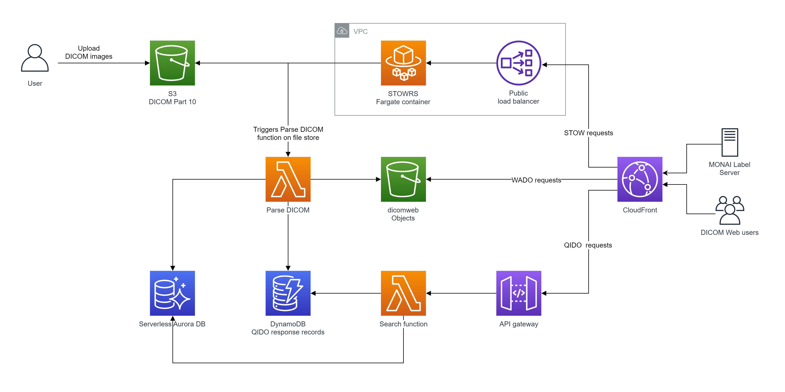

# Welcome to the Static DICOM Web project!

This project demonstrates the use of Static DICOM Web for storage of medical images. 
- Images in DICOM format are uploaded to S3 storage or sent via STOWRS.
- Store event triggers a Lambda function that converts DICOM images into WADO responces and stores them on S3.
- Lambda function generates QIDO responce for each study and stores it in DynamoDB with StudyInstanceUID as primary key.
- Study level and Series Level attribudtes are indexed in serverless Aurora DB. 
- QIDO search queries are translated into SQL statements. Search supports Limit and Offset for results pagination. Search returns resultset returns list of StudyInstanceUID for matching studies. QIDO response for each matching studie is queried from DynamoDB.
- In most of historical datasets attribute MoalitiesInStudy is missing. This attribute is used in open source viewer OHIF to display study modality. Most of PACS systems implement profiling and tag morphing before inserting metadata inot database. We do not have profiling in the project and do not correct the value of the tag. To display modality on OHIF viewer we are inserting list of modalitied in QIDO response. This is not intended to be a production level solution to missing tag problem. We do not insert ModalitiesInStudy attribute into the study metadata. 
- AWS CloudFront provides web access to stored DICOM Web static pixel data and metadata.
- Web distribution includes index.html file that points to open source OHIF viewer for viewing
- uploaded images.





## Project features

Supported QIDO queries:
1. Search for All Studies:         /studies[?query]
2. Search for All Series:          /series[?query]
3. Search for Series in a Study:   /studies/{studyInstanceUid}/series[?query]

Supported STOWRS modes:
1. store request with DICM binary (multipart/related; type="application/dicom") with Store Instances Response Module as XML.
2. store request with DICOM binary (multipart/related; type="application/dicom") with Store Instances Response Module as JSON.

## Requirements
You will need the following software packages installed locally to deploy this solution in AWS Cloud.

**Python3/pip:**<br>The deployment automation code is written in Python.

**CDK:**<br>Please refer to CDK documentation to install the framework and bootstrap your AWS environment.

**Docker:**<br>When running the CDK deploy command, the container images will automatically be built (via docker build command), and sent to AWS ECR registry. Docker must be present on the machine where the cdk deployment is executed. Docker desktop is sufficient. Refer to Docker Desktop documentation to install it on your machine.

**Domain name and Certificate:**<br>The STOWRS-to-S3 web service is exposed via HTTPS. Because AWS CloudFront will verify that the certificate exposed by the web service is valid, it is requires to have a valid FQDN and certificate to associate to the service. Domain name, related FQDN and certificates can be created vi AWS Route53 and AWS ACM. The service also supports the usage of a private certificate or certificates issued by other authority than ACM ( eg. Let's Encrypt Certbot ).

**Compatible region:**<br>This project is compatible in the following regions: ap-south-1, eu-north-1, eu-west-3, eu-west-2, eu-west-1, ap-northeast-3, ap-northeast-2, ap-northeast-1, ca-central-1, sa-east-1, ap-southeast-1, ap-southeast-2, eu-central-1, us-east-1, us-east-2, us-west-1, us-west-2.

## To deploy the project
1. Use a new AWS account to avoid quota limits
2. Bootstrap the AWS account for CDK. Refer to [CDK documentation regarding bootstraping](https://docs.aws.amazon.com/cdk/v2/guide/bootstrapping.html).
3. Make sure your account has Lambda Concurrency quota >50. Deployment will set concurrency of "dicom_to_static_web" Lambda function which is only possible with quota >50.
4. Clone this repository and Navigate to the cloned project's ./CDK directory
5. **In the CDK directory**, create virtualenv for Python. Virtual environment is needed to deploy required versions of packages:

```
$ python3 -m venv .venv
```

After the init process completes and the virtualenv is created, you can use the following
step to activate your virtualenv.

```
$ source .venv/bin/activate
```

If you are a Windows platform, you would activate the virtualenv like this:

```
% .venv\Scripts\activate.bat
```

Once the virtualenv is activated, you can install the required dependencies.

```
$ pip install -r requirements.txt
```

Configure the STOW FQDN and certificate ARN in the file `cdk/config.py`.
```json
CERTIFICATE = {
    "certificate_arn" : "[replace with an ACM certificate ARN]", #Replace
    "stow_fqdn" : "[replace with your fully qualified domain name]", #Replace
    "certificate_auth_mode" : "anonymous", #Leave as default.
    "certificate_mode" : "ACM", #Leave as default.
    "certificate_bucket" : "", #Leave as default.
}
```
<b>Note:</b> The certifiate point by the ACM ARN needs to contains SAN or CN entries matching with the FQDN provided as value of the parameter `stow_fqdn`.


At this point you can synthesize and deploy the CloudFormation template for this code.

```
$ cdk deploy
```


## Post deployment tasks

### STOW service DNS update
The deployment automatically configures the CloudFront STOW-RS service origin with the provided domain FQDN in the `CDK/config.py`. A CNAME record linking the provided FQDN ( in the `config.py`) to the STOWRS network load balancer DNS name needs to be added in the DNS system managing the FQDN. The Network load balancer DNS name can be found in the AWS web console->EC2->Load Balancers, in the description tab of the load balancer named wado-nlbNL-XXXXXXXXXXXXX. the STOW-RS DNS name is also provided as an output of the `cdk deploy` command. 

### Securing access to the DICOM Web interfaces
At the end of the deployment the DICOM services are publicly accessible via CloudFront. You can secure the access by implementing AWS WAF with of CloudFront. Refer to the [WAF control access section of CloudFront documentation](https://docs.aws.amazon.com/AmazonCloudFront/latest/DeveloperGuide/distribution-web-awswaf.html) for more information.

## Useful commands

 * `cdk ls`          list all stacks in the app
 * `cdk synth`       emits the synthesized CloudFormation template
 * `cdk deploy`      deploy this stack to your default AWS account/region
 * `cdk diff`        compare deployed stack with current state
 * `cdk docs`        open CDK documentation

